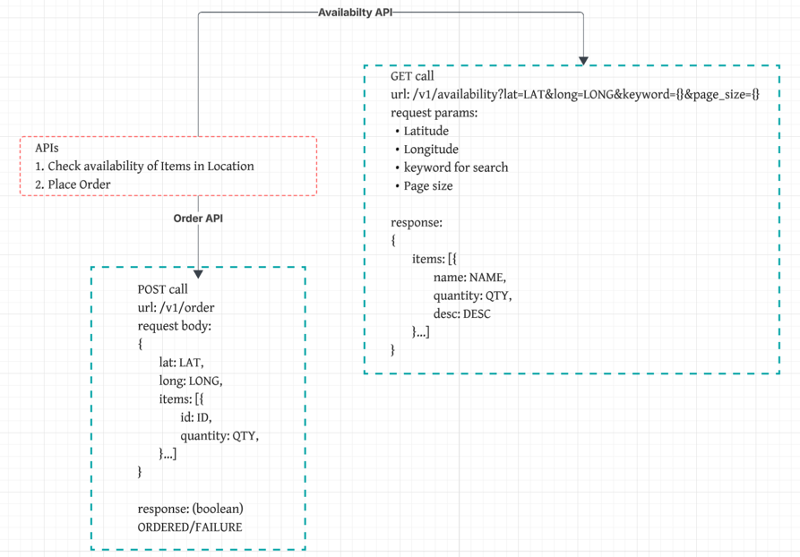

# Design a Delivery Service

To design a delivery service
- we need to be able to query availability of items in our **Distribution Centers (DCs)** and place orders.

## Understanding the problem 

### Functional Requirements

- Customers should be able to query availability of items, deliverable in 1 hour, by location (i.e. the effective availability is the union of all inventory nearby DCs).
- Customers should be able to order multiple items at the same time.

### Out of Scope

- Handling payments/purchases.
- Handling driver routing and deliveries.
- Search functionality and catalog APIs. (The system is strictly concerned with availability and ordering).
- Cancellations and returns.

### Non-Functional Requirements

1. Availability requests should be fast (<100ms) to support use-cases like search.
2. Ordering should be strongly consistent: two customers should not be able to purchase the same physical product.
3. System should be able to support 10k DCs and 100k items in the catalog across DCs.
4. Order volume will be O(10m orders/day)

## Set-Up

### Core Entities

- Items: A type of item, e.g. Cheetos. These are what our customers will actually care about.
- Inventory: A physical instance of an item, located at a DC. We'll sum up Inventory to determine the quantity available to a specific user for a specific Item.
- Distributed Centers (DCs): A physical location where items are stored. We'll use these to determine which items are available to a user. Inventory are stored in DCs.
- Order: A collection of Inventory which have been ordered by a user (and shipping/billing information).
- Order Items

### APIs

Two APIs are needed
- Fetch the items available to user in the given location using a keyword
- Place a order

