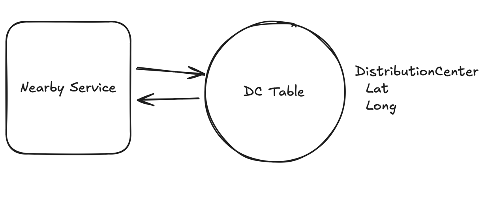
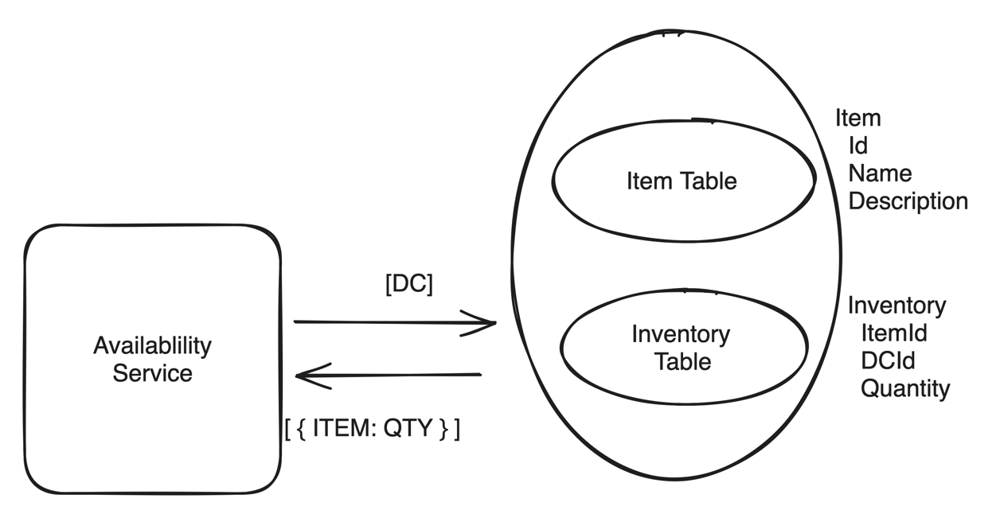
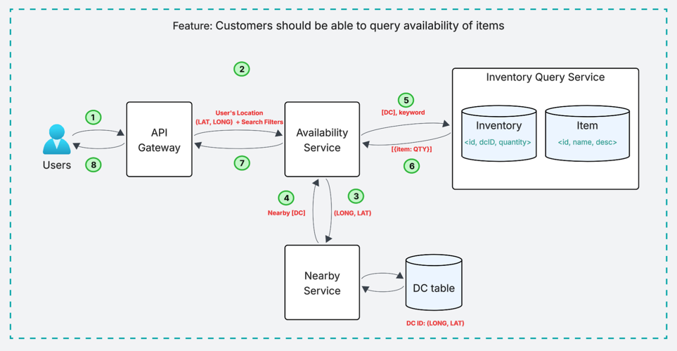
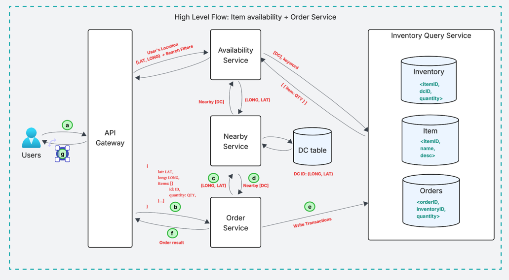
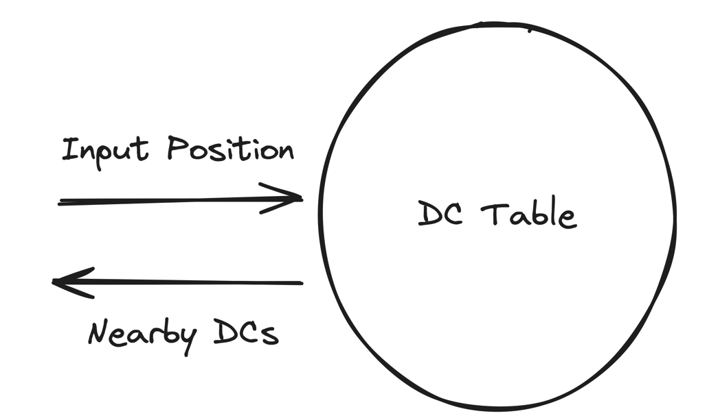
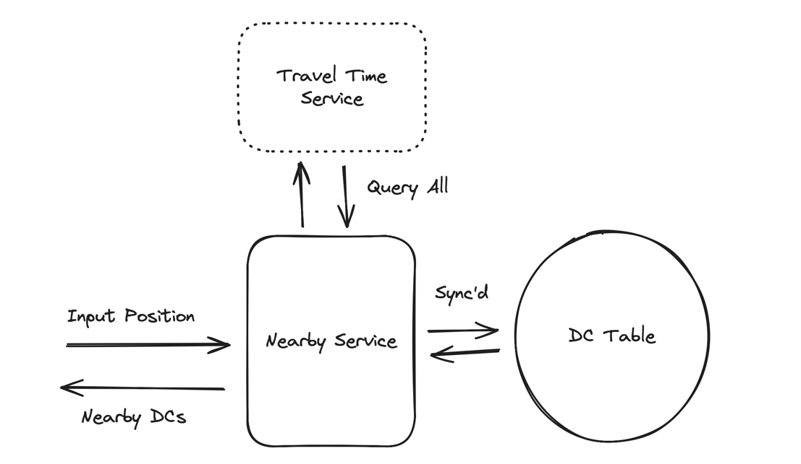
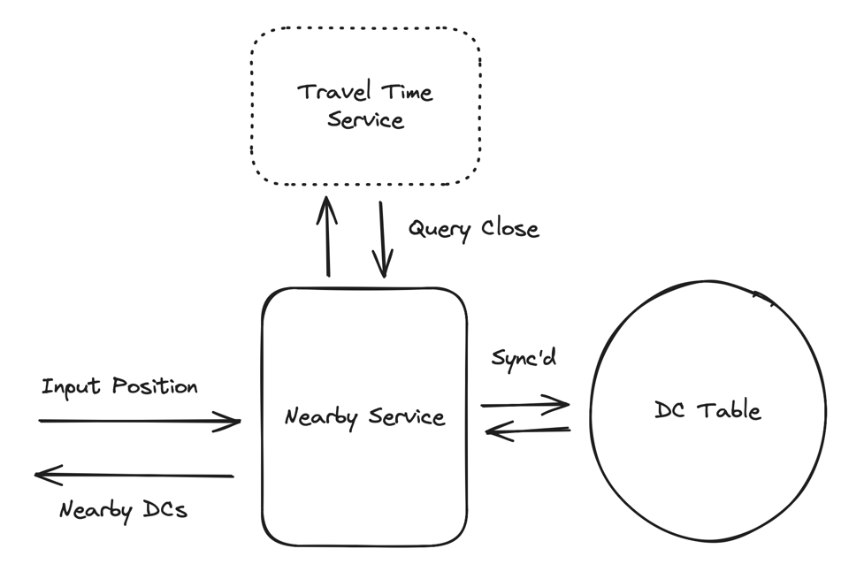
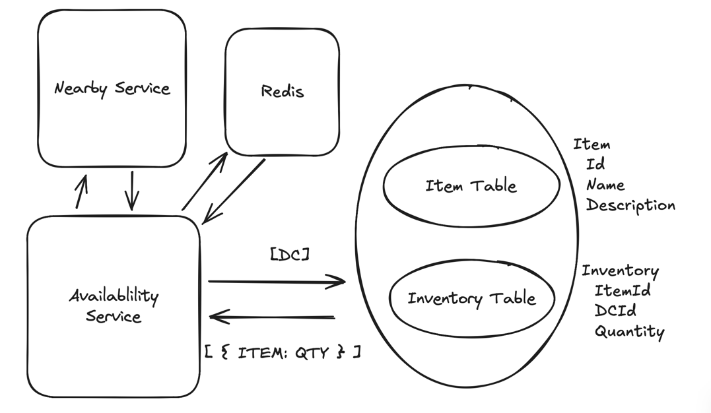
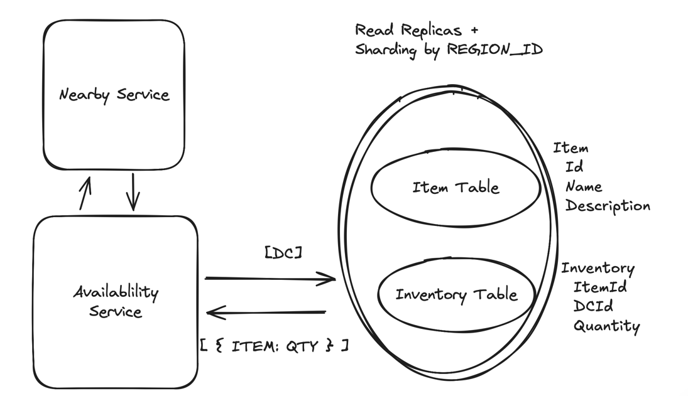

# Design a Delivery Service

To design a delivery service
- we need to be able to query availability of items in our **Distribution Centers (DCs)** and place orders.

## Understanding the problem 

### Functional Requirements

- Customers should be able to query availability of items, deliverable in 1 hour, by location (i.e. the effective availability is the union of all inventory nearby DCs).
- Customers should be able to order multiple items at the same time.

### Out of Scope

- Handling payments/purchases.
- Handling driver routing and deliveries.
- Search functionality and catalog APIs. (The system is strictly concerned with availability and ordering).
- Cancellations and returns.

### Non-Functional Requirements

1. Availability requests should be fast (<100ms) to support use-cases like search.
2. Ordering should be strongly consistent: two customers should not be able to purchase the same physical product.
3. System should be able to support 10k DCs and 100k items in the catalog across DCs.
4. Order volume will be O(10m orders/day)

## Set-Up

### Core Entities

- Items: A type of item, e.g. Cheetos. These are what our customers will actually care about.
- Inventory: A physical instance of an item, located at a DC. We'll sum up Inventory to determine the quantity available to a specific user for a specific Item.
- Distributed Centers (DCs): A physical location where items are stored. We'll use these to determine which items are available to a user. Inventory are stored in DCs.
- Order: A collection of Inventory which have been ordered by a user (and shipping/billing information).
- Order Items

### APIs

Two APIs are needed
- Fetch the items available to user in the given location using a keyword
- Place a order

---

## High Level Design

### Feature 1. Customers should be able to query availability of items

- We need 2 steps
  - Find DCs that are close enough to the user
  - Once we have the list of serviceable DCs, we can check the inventory and return a union to the user
> Note: Each step should be very fast, since we want the e2e latency to be ~100ms

#### 1a. Find the nearby DCs

- We can build an internal API to which takes longitude and latitude of user and returns a list of DCs within 1 hour.
- Assuming we have a table of all DCs with their LAT and LONG.
- We can add simple math (Euclidean or Haversine formula (advanced)) to find the distance

#### 1b. Check the inventory of found DCs

- We can query by joining our item table and inventory table
- Let's assume we have postgres DB, we get name, description and quantity of the items from the join.

> Note: 
> - In real e-commerce systems, Catalog and Inventory are stored separately. Reason: different consumers + workloads
> - In this design: keeping them in the same DB (simplification for requirements)
> - Mention in interview:
>   - Ideally separate Catalog & Inventory
>   - Use search index (e.g., Elasticsearch) for catalog search

#### Design Diagram using Feature 1

1. User makes a request with (keyword, LAT, LONG)
2. API gateway forwards the request to Availability Service.
3. Availability Service calls nearby service with user's LAT and LONG
4. Nearby service uses DC table to find the nearby DCs and returns a list.
5. Availability Service calls inventory query on all the nearby DCs found.
6. The Inventory query joins item and inventory table to find the available quantity of asked items (uses keyword if provided) and returns a list of all items and their available quantities (this returned list is a union of all nearby DCs).

### Feature 2: Customers should be able to order items.

- This feature requires strong consistency (We don't want two users placing order for same item.)
- Steps involved:
  - Check Inventory
  - Record order placed (hold items)
  - Update Inventory
> Note: We need to do these above 3 steps atomically

#### How do we handle double booking?
- Prevent double booking → common system design concern
- Need locking mechanism on inventory

##### Approach 1: Two different data-stores with distributes locks
| Aspect           | Description                                      | Impact / Risk                  | Mitigation / Notes                       |
|------------------|--------------------------------------------------|--------------------------------|------------------------------------------|
| **Architecture** | Separate DBs for Orders & Inventory              | Flexibility, optimized storage | Use best DB per use case                 |
| **Orders DB**    | Relational database                              | Strong consistency for orders  | Suitable for transactional data          |
| **Inventory DB** | Key-value store                                  | Fast reads/writes              | Optimized for high-throughput updates    |
| **Failure Case** | Order created but inventory not decremented      | Overselling, inconsistency     | Background reconciliation / sweeper jobs |
| **Deadlock**     | User1 locks A, needs B User2 locks B, needs A | System stuck / no progress     | Lock ordering, timeouts, retries         |
| **Overall Risk** | Distributed system complexity                    | Harder to maintain consistency | Requires careful failure handling        |

##### Approach 2: Singular Postgres Transaction

| Aspect               | Description                                 | Impact / Benefit           | Tradeoff / Risk                         |
|----------------------|---------------------------------------------|----------------------------|-----------------------------------------|
| **Architecture**     | Single DB (Postgres) for Orders + Inventory | Simpler design             | Tight coupling of services              |
| **ACID Properties**  | Leverages ACID guarantees                   | Strong consistency         | Reduced flexibility                     |
| **Isolation Level**  | Uses SERIALIZABLE isolation                 | Prevents race conditions   | Lower throughput under high concurrency |
| **Transaction Flow** | Single transaction for order + inventory    | Atomicity + consistency    | Longer transaction duration             |
| **Concurrency**      | One of concurrent orders fails to commit    | No double booking          | Retry handling required                 |
| **Scaling**          | Orders & Inventory scale together           | Easier to manage initially | Hard to scale independently             |
| **Flexibility**      | Cannot use specialized DBs per use case     | Simpler stack              | Suboptimal performance at scale         |
| **Overall Tradeoff** | Strong consistency + simplicity             | Reliable system            | Scalability limitations                 |

> Note: When atomicity is required, utilize the ACID properties of the DB.

- By choosing the Approach 2 and leaning in to our existing Postgres database we can keep our system simple and still meet our requirements. 

#### Flow for Feature 2

- For an order, the process looks like this:
  - The user makes a request to the Orders Service to place an order for items A, B, and C.
  - The Orders Service creates a singular transaction which we submit to our Postgres leader. This transaction: 
    - Checks the inventory for items A, B, and C > 0. 
    - If any of the items are out of stock, the transaction fails. 
    - If all items are in stock, the transaction records the order and updates the status for inventory items A, B, and C to "ordered". 
    - A new row is created in the Orders table (and OrderItems table) recording the order for A, B, and C.
    - The transaction is committed.
  - If the transaction succeeds, we return the order to the user.

### High Level Design

- Both our `Availability` and `Orders` service use the `Nearby` service to look up DCs that are close enough to the user.
- We have a singular Postgres database for inventory and orders, partitioned by region
- Our Availability service reads via read replicas, our Orders service writes to the leader using atomic transactions to avoid double writes.

---

## Deep Dive

### 1. Availability lookups to incorporate traffic and drive time.

- Current approach: **distance-based DC selection**
- Problem:
  - Ignores real-world constraints:
  - Rivers / borders
  - Road network
  - Traffic conditions
- Result: inaccurate "nearest" DC

#### Approaches

| Approach                                      | Description                                                                                      | Benefit                                    | Challenges / Risks                                                                                             | Optimization / Notes                                              | Diagram                                  |
|-----------------------------------------------|--------------------------------------------------------------------------------------------------|--------------------------------------------|----------------------------------------------------------------------------------------------------------------|-------------------------------------------------------------------|------------------------------------------| 
| **Approach 1: SQL Distance**                  | Store DC lat/long in DB → compute distance (Euclidean / Haversine) → filter within X radius      | Simple, fast, no external dependency       | Ignores traffic, roads, real travel time Inaccurate proximity Multiple DCs in same city not handled well | Good as **initial pre-filter**                                    |  |
| **Approach 2: Travel Time (All DCs)**         | Sync DCs to memory → call travel-time API for **every DC**                                       | Accurate (real travel time, traffic-aware) | Too many API calls High cost + latency Most DCs irrelevant                                               | Not scalable directly                                             |  |
| **Approach 3: Hybrid (Nearby + Travel Time)** | Sync DCs → filter by radius (e.g., 60 miles) → call travel-time API only for filtered candidates | Balanced: accuracy + efficiency            | Still some API overhead Radius tuning needed                                                                | **Best approach (industry standard)** Combines speed + realism |  |

> We pick approach 3

### 3. Availability lookups to be fast and scalable

- Current: Availability fetched directly from DB → high load
- Problem: 
  - Does not scale
  - DB becomes read bottleneck
  - High latency + potential throttling

- Estimation:
  - Orders/day = 10M
  - Users browse ~10 pages/order
  - Conversion rate = 5%
  - QPS: `10M / 100k sec * 10 / 0.05 = 20k QPS`
  - → Very high read load

#### Approaches

| Approach                                     | Description                                                                                                 | Benefit                                                           | Challenges / Risks                                   | Optimization / Notes                                                                                     | Diagram                                  |
|----------------------------------------------|-------------------------------------------------------------------------------------------------------------|-------------------------------------------------------------------|------------------------------------------------------|----------------------------------------------------------------------------------------------------------|------------------------------------------|
| **Approach 1: Cache (Redis)**                | Query availability via cache → on miss fetch from DB → populate cache (TTL ~1 min)                          | Very low latency Handles high QPS (20k+)                       | Cache consistency issues Stale data risk          | Use **cache invalidation** on inventory updates Read-through / write-through patterns                 |  |
| **Approach 2: Read Replicas + Partitioning** | Partition inventory by region (e.g., zipcode prefix) Use Postgres read replicas for availability queries | Scales reads horizontally Reduces query scope (1–2 partitions) | Replica sizing complexity Hot partitions possible | Route reads to replicas Writes go to leader (strong consistency) Rebalance partitions periodically |    |

> We pick approach 2

