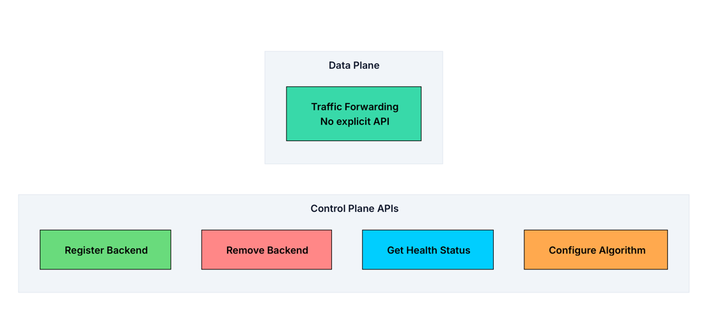
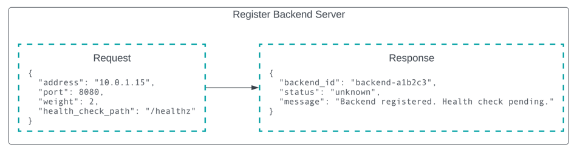
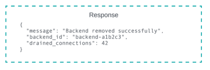
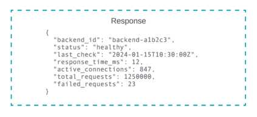
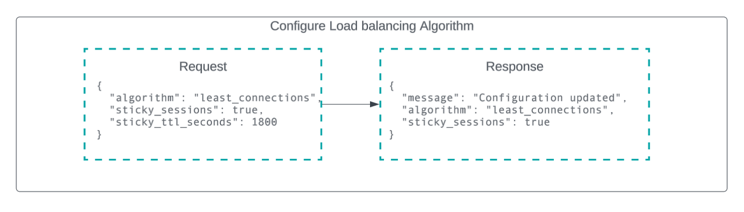
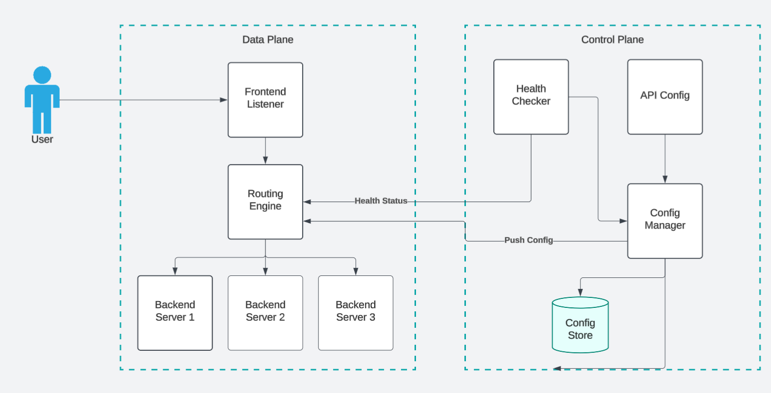
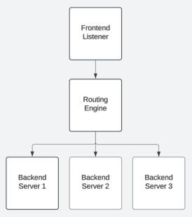
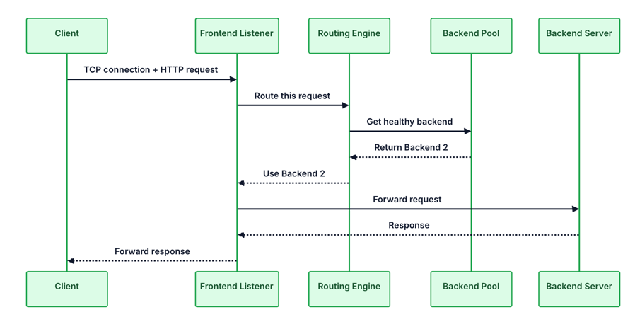
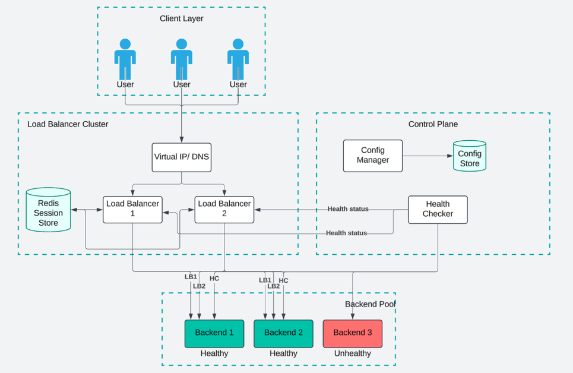

# Design a Load Balancer

A Load Balancer is a critical infrastructure component that distributes incoming network traffic across multiple servers to ensure no single server becomes overwhelmed.

> Problem: 
>   - instead of routing all traffic to one server (which would eventually crash under heavy load),
>   - a load balancer acts as a traffic cop, intelligently spreading requests across a pool of healthy servers. 
>   - This improves application availability, responsiveness, and overall system reliability.

## Requirements

> `Candidate`: "What type of traffic should the load balancer handle? Are we focusing on HTTP/HTTPS traffic, or should it support any TCP/UDP traffic?"
> 
> `Interviewer`: "Let's design a general-purpose load balancer that supports both Layer 4 (TCP/UDP) and Layer 7 (HTTP/HTTPS) load balancing."

> `Candidate`: "What is the expected scale? How many requests per second should the system handle?"
> 
> `Interviewer`: "The load balancer should handle up to 1 million requests per second at peak traffic."

> `Candidate`: "How should we handle server failures? Should the load balancer automatically detect and route around unhealthy servers?"
> 
> `Interviewer`: "Yes, health checking is critical. The system should detect failures within seconds and stop routing traffic to unhealthy servers."

> `Candidate`: "Do we need to support session persistence, where requests from the same client go to the same backend server?"
> 
> `Interviewer`: "Yes, sticky sessions should be supported for stateful applications, but it should be configurable."

> `Candidate`: "What about SSL/TLS termination? Should the load balancer handle encryption?"
> 
> `Interviewer`: "Yes, SSL termination at the load balancer is required to offload encryption work from backend servers."

> `Candidate`: "What availability target should we aim for?"
> 
> `Interviewer`: "The load balancer itself must be highly available with 99.99% uptime, since it's on the critical path for all traffic."

### Functional Requirements

- **Traffic Distribution**: Distribute incoming requests across multiple backend servers using configurable algorithms.
- **Health Checking**: Continuously monitor backend servers and automatically remove unhealthy ones from the pool.
- **Session Persistence**: Support sticky sessions to route requests from the same client to the same server.
- **SSL Termination**: Handle SSL/TLS encryption and decryption to offload work from backend servers.
- **Layer 4 and Layer 7 Support**: Support both transport-level (TCP/UDP) and application-level (HTTP/HTTPS) load balancing.

### Non Functional Requirements
- **High Availability**: The load balancer must be highly available (99.99% uptime) with no single point of failure.
- **Low Latency**: Should add minimal latency to requests (< 1ms overhead).
- **High Throughput**: Handle up to 1 million requests per second at peak.
- **Scalability**: Should scale horizontally to handle increasing traffic.
- **Fault Tolerance**: Continue operating even when individual components fail.

---

## Estimations

### 1. Traffic 
| Category | Metric                 | Value     | Notes                  |
|----------|------------------------|-----------|------------------------|
| Traffic  | Peak RPS               | 1,000,000 | Maximum load           |
| Traffic  | Average RPS            | ~300,000  | ~1/3 of peak           |
| Traffic  | Concurrent Connections | ~500,000  | Derived using duration |

### 2. Concurrent Connections Calculation

| Parameter            | Value                                   |
|----------------------|-----------------------------------------|
| Avg Request Duration | 0.5 sec (500 ms)                        |
| Formula              | Concurrent Connections = RPS × Duration |
| Calculation          | 1,000,000 × 0.5                         |
| Result               | 500,000 connections                     |

### 3. Bandwidth Estimates

| Type              | Formula     | Value              |
|-------------------|-------------|--------------------|
| Request Size      | —           | 2 KB               |
| Response Size     | —           | 10 KB              |
| Ingress Bandwidth | 1M × 2 KB   | 2 GB/s             |
| Egress Bandwidth  | 1M × 10 KB  | 10 GB/s            |
| Total Bandwidth   | 2 + 10 GB/s | 12 GB/s (~96 Gbps) |

### 4. Health Check Overhead

| Parameter       | Value              |
|-----------------|--------------------|
| Backend Servers | 1000               |
| Check Interval  | 5 sec              |
| Formula         | Servers / Interval |
| Result          | 200 checks/sec     |
| Impact          | Negligible         |

### 5. Memory Requirements (Per Connection)

| Component                | Size           |
|--------------------------|----------------|
| Source IP + Port         | 6 bytes        |
| Destination IP + Port    | 6 bytes        |
| Connection State         | 4 bytes        |
| Timestamps               | 16 bytes       |
| Protocol Data            | ~200 bytes     |
| Buffer Space             | ~250 bytes     |
| **Total per Connection** | **~500 bytes** |

### Summary

| Area          | Observation                 | Impact                         |
|---------------|-----------------------------|--------------------------------|
| Network       | ~12 GB/s (~96 Gbps)         | 🚨 Primary bottleneck          |
| Memory        | ~250 MB                     | ✅ Not a concern                |
| Health Checks | 200 RPS                     | ✅ Negligible                   |
| Scalability   | Single machine insufficient | 🚀 Requires horizontal scaling |

---

## Core APIs

| Plane             | Purpose                            | Characteristics              | API requirement        |
|-------------------|------------------------------------|------------------------------|------------------------|
| **Data Plane**    | Handles actual request traffic     | High throughput, low latency | No                     |
| **Control Plane** | Handles configuration & management | Low traffic, high importance | Explicit APIs required |

## APIs for Control Plane

### 1. Register Backend Server

Endpoint: `POST /backends`

- When you spin up a new application server, you need to tell the load balancer about it. 
- This endpoint adds a backend to the pool and starts health checking it.

> The initial status is "unknown" because we have not run a health check yet. Within a few seconds, it will transition to "healthy" or "unhealthy."

### 2. Remove Backend Server

Endpoint: `DELETE /backends/{backend_id}`

- When you want to decommission a server (for maintenance, scaling down, or replacement), this endpoint removes it from the pool. 
- The load balancer will stop sending new traffic immediately, but existing connections are allowed to complete gracefully.
- path params: `backend_id` - the ID returned when the backend was registered

> The `drained_connections` field tells you how many connections were in progress when the backend was removed.

### 3. Get Backend Health Status

Endpoint: `GET /backends/{backend_id}/health`

- Returns detailed health information about a specific backend, useful for debugging and monitoring dashboards.

> The response includes both current state (status, active connections) and historical metrics (total requests, failures) to help operators understand backend performance over time.

### 4. Configure Load Balancing Algorithm

Endpoint: `PUT /config/algorithm`

- Changes how traffic is distributed across backends. 
- This takes effect immediately for new connections (existing connections are not affected).

---

## High Level Design

- Fundamental operations
  - **Distribute Traffic**: Accept incoming requests and forward them to healthy backend servers.
  - **Monitor Health**: Continuously check backends and route around failures.
  - **Stay Available**: The load balancer itself cannot be a single point of failure.

- The architecture will split into two parts
  - Data plane 
    - handles actual traffic at high speed
    - must be fast since every request flows through it
  - Control plane 
    - manages configuration and health checking at a slower pace.
    - can be slower since configuration changes and health checks happen infrequently compared to request traffic

### 1. Traffic Distribution

- The most basic job of a load balancer is accepting connections from clients and forwarding them to backend servers. 
- Components Involved:
  - Frontend Listeners
  - Routing Engine
  - Backend Pool

#### Frontend Listeners

- This is the entry point for all client traffic. 
- The frontend listener binds to one or more ports (typically 80 for HTTP, 443 for HTTPS) and accepts incoming TCP connections.
- When a connection arrives, the listener needs to:
  - Accept the TCP connection from the client
  - For Layer 7 load balancing, parse enough of the request to make routing decisions (HTTP headers, URL path, etc.)
  - Hand off the connection to the routing engine for backend selection

#### Routing Engine
- This is the brain of the load balancer. 
- Given a connection, the routing engine decides which backend server should handle it.
- The routing engine maintains:
  - A list of available backend servers and their metadata (address, port, weight)
  - The current state of each backend (healthy, unhealthy, draining)
  - Counters for connection tracking (needed for least-connections algorithm)
  - The configured load balancing algorithm
- When the frontend listener hands off a connection, the routing engine applies the configured algorithm (round robin, least connections, etc.) and returns the selected backend.

#### Backend Pool

- A backend pool is a logical group of servers that can handle the same type of traffic.
- Key Idea: `Pool = set of interchangeable backend servers`
- Simple Setup
  - Single backend pool
  - All requests routed to same group of servers
- Complex Setup (Real Systems)
  - Multiple Pools based on service type:
  - API Pool → handles /api requests
  - Static Content Pool → serves images, CSS, JS
  - Auth Pool → handles login/authentication

- Each pool contains:
  - A list of backend servers with their addresses and ports
  - Pool-specific configuration (algorithm, health check settings)
  - Health status for each backend in the pool

#### Request Flow through system

1. **Connection arrives**: A client sends an HTTP request to the load balancer's public IP address (e.g., https://api.example.com).
2. **Frontend listener accepts**: The listener accepts the TCP connection and, for HTTP traffic, reads enough of the request to understand what is being asked (the URL, headers, etc.).
3. **Routing decision**: The listener asks the routing engine to select a backend. The engine checks the backend pool, filters out unhealthy servers, and applies the configured algorithm.
4. **Forward to backend**: The request is forwarded to the selected backend server. This might be a simple proxy (read request, forward, read response) or a more sophisticated connection multiplexing setup.
5. **Return response**: The backend processes the request and sends a response. The load balancer forwards this back to the client.
6. **Connection handling**: Depending on configuration, the client connection might be kept alive for additional requests (HTTP keep-alive) or closed

---

### 2. Health Monitoring

- Without health checking, the load balancer would blindly keep sending traffic to dead servers, and users would see errors.
- Health monitoring solves this by continuously checking each backend and automatically routing around failures.

- New Component: Health Checker
  - a background process that periodically probes each backend server to verify it is working correctly.
  - Sends periodic probes to each backend (typically every 5-10 seconds)
  - Tracks the history of successes and failures
  - Decides when a backend should be marked unhealthy (usually after 2-3 consecutive failures)
  - Decides when an unhealthy backend can be marked healthy again (after 2-3 consecutive successes)
  - Notifies the routing engine whenever a backend's status changes
- This entire process happens automatically. No human intervention is required to handle a failed server.

#### Types of Health Checks
| Type              | How It Works                                                      | When to Use                                    |
|-------------------|-------------------------------------------------------------------|------------------------------------------------|
| **TCP Check**     | Opens a TCP connection and closes it                              | Basic connectivity check                       |
| **HTTP Check**    | Sends HTTP request (e.g., `GET /health`) and expects 2xx response | Web apps / APIs                                |
| **Custom Script** | Executes user-defined script/command                              | Advanced validation (DB, queues, dependencies) |

> Note: Most production deployments use HTTP health checks. The application exposes a /health or /healthz endpoint that returns 200 OK when everything is working, and returns an error (or times out) when something is wrong.

---

### 3. High Availability

- Problem?
  - We built a load balancer to eliminate single points of failure in our backend, but the load balancer itself is now a single point of failure.
  -  If it crashes, all traffic stops.
- Solution: Run multiple load balancer instances.
- But we have to handle questions like - 
  - How do clients know which instance to connect to?
  - What happens when one instance fails?
  - How do we handle state (like sticky sessions) across multiple instances?

> There are two patterns to solve above problem

#### Patterns to solve above Problem

| Aspect                   | Active-Passive                      | Active-Active                        |
|--------------------------|-------------------------------------|--------------------------------------|
| **Basic Idea**           | One node active, one standby        | Multiple nodes active simultaneously |
| **Traffic Handling**     | Only active node serves traffic     | Traffic distributed across all nodes |
| **Client Connection**    | Via **VIP (Virtual IP)**            | Multiple IPs / shared IP             |
| **Failover Mechanism**   | Standby takes over VIP using ARP    | Other nodes continue serving traffic |
| **Failure Impact**       | Short disruption (1–3 sec failover) | Reduced capacity, no downtime        |
| **Resource Utilization** | ❌ 50% wasted (idle standby)         | ✅ Fully utilized                     |
| **Complexity**           | Simple                              | Complex                              |
| **State Management**     | No sync needed                      | Requires state sync (e.g., sessions) |
| **Sticky Sessions**      | Easy (all state on one node)        | Requires shared state store          |
| **Scalability**          | Limited                             | Highly scalable                      |
| **Setup Difficulty**     | Easy                                | Moderate–Hard                        |

> For most production systems handling significant traffic, active-active is the better choice despite its complexity. The benefits of full resource utilization and instant failover outweigh the added complexity of state synchronization.

### High level design - Diagram

1. **Clients connect to the VIP**. They do not know (or care) about the individual load balancer nodes. The VIP is a stable entry point that abstracts away the LB cluster.
2. **Traffic is distributed across LB nodes**. In active-active mode, both LB Node 1 and LB Node 2 handle traffic simultaneously.
3. **Each LB node routes to healthy backends**. Backend 3 failed health checks and is marked unhealthy (red), so no traffic goes to it. LB nodes only send traffic to Backends 1 and 2.
4. **Session state is shared**. If a user's first request hits LB Node 1 and sticky sessions are enabled, their session mapping is stored in Redis. If their next request happens to hit LB Node 2, it can still route them to the correct backend by looking up their session in Redis.
5. **Health checking runs continuously**. The Health Checker monitors all backends and both LB nodes. When it detects Backend 3 is unhealthy, it notifies both LB nodes to stop routing traffic there.
6. **Configuration is managed centrally**. The Config Manager stores configuration (backend lists, algorithms, health check settings) in the Config Store and pushes updates to all LB nodes.

#### Component Summary
| Component                 | What It Does                                          | Key Characteristics                                            |
|---------------------------|-------------------------------------------------------|----------------------------------------------------------------|
| **Virtual IP / DNS**      | Provides a stable entry point for clients             | Abstracts LB cluster, hides internal changes                   |
| **LB Nodes**              | Accept incoming requests and route to backend servers | Stateless, horizontally scalable                               |
| **Session Store (Redis)** | Stores sticky session mappings                        | Shared across LB nodes, enables session persistence            |
| **Health Checker**        | Continuously monitors backend and LB health           | Runs in background, ensures only healthy nodes receive traffic |
| **Config Manager**        | Manages LB configuration via APIs                     | Handles updates, validation, and distribution                  |
| **Config Store**          | Persists configuration data                           | Distributed store (e.g., etcd, Consul, DB)                     |
| **Backend Pool**          | Group of application servers handling requests        | Organized by service type, enables scaling & isolation         |

---

## Database Design

## Glossary

### Layer 4 vs Layer 7 Load Balancer
| Aspect                         | Layer 4 Load Balancing                  | Layer 7 Load Balancing                    |
|--------------------------------|-----------------------------------------|-------------------------------------------|
| OSI Layer                      | Transport Layer (L4)                    | Application Layer (L7)                    |
| Protocols                      | TCP, UDP                                | HTTP, HTTPS, gRPC                         |
| Routing Basis                  | IP address, Port                        | URL, Headers, Cookies, Body               |
| Content Awareness              | ❌ Not aware                             | ✅ Content-aware                           |
| Processing                     | Packet-level forwarding                 | Request-level inspection                  |
| Performance                    | ⚡ Very high (low latency)               | Moderate (higher latency)                 |
| Flexibility                    | Limited                                 | Highly flexible                           |
| Algorithms                     | Round Robin, Least Connections, IP Hash | Advanced (path-based, header-based, etc.) |
| SSL Termination                | ❌ Not supported                         | ✅ Supported                               |
| Caching / Auth / Rate Limiting | ❌ Not possible                          | ✅ Possible                                |
| Complexity                     | Simple                                  | Complex                                   |
| Use Cases                      | High-throughput, simple routing         | Web apps, APIs, microservices             |
| Examples                       | AWS Network Load Balancer, HAProxy      | NGINX, AWS Application Load Balancer      |